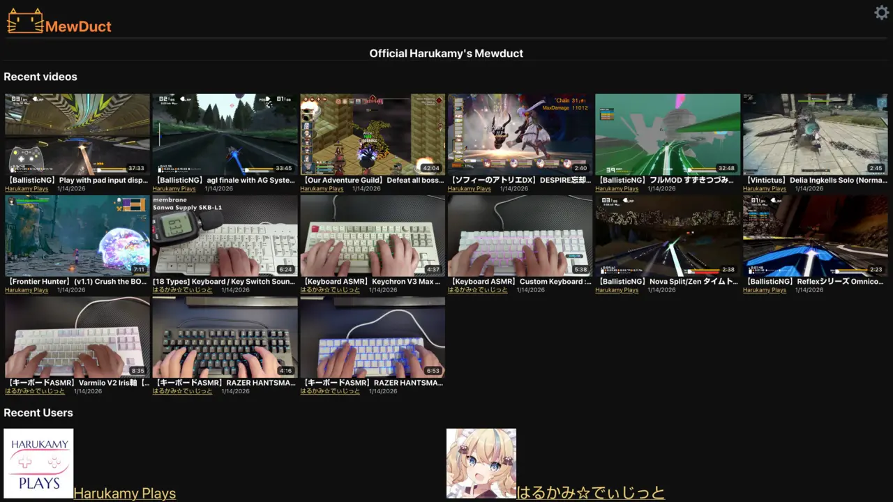
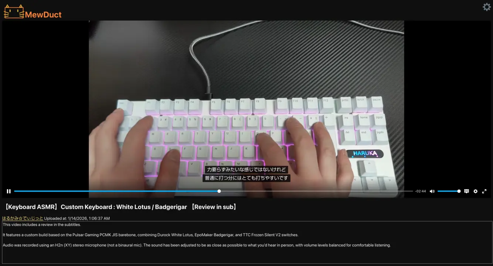

# Mewduct


Video streaming CMS without a server-side application

## Description

Mewductは動画配信サイトの構成をクライアントサイドアプリケーションと、webサーバーが静的配信するファイルで実現している。
サーバー上に配信するファイルを配置するだけで良いので、サーバー側にアプリケーションサーバーを必要とせず、動画処理をローカルで行えるためサーバーインスタンスに対するリソース要求を非常に小さく抑えることができる。

Mewductは既存の動画プラットフォーム(e.g. YouTube, Vimeo)を使いたくないが、動画エンコードもサーバーで行える高性能で高価なサーバーインスタンスの運営もしたくない人に向けて作られた。

配信に必要なファイルの構成は、コマンドラインスクリプトによって行う。
一部の設定(動画のタイトルや説明文の設定など)はコマンドラインスクリプトによって提供されておらず、ファイルを直接編集することで実現する。

コマンドラインスクリプトの役割は、動画配信で使われるファイルを正しく配置することである。

Mewductはマルチユーザーに対応していますが、動画アップロード時にコマンドを実行する必要があるため、マルチユーザーで動画をアップロードするのに適した機能が提供されていない。
ただ、アップロードされたときにフックしてコマンドを実行すれば良いだけなので、作るのは難しくないだろう。

Mewductは視聴者にユーザーアカウントを要求しない。
このため、公開する相手を限定した動画は設定できない。
ただし、ホームやユーザーページに掲載しないという意味の限定公開動画は設定可能となっている。

## Screenshots






[作者のインスタンス](https://mewduct.haru-lab.net/)

## ローカルとサーバーの分担方法

最終的には配信するファイルをサーバー上に配置する必要があるが、どのタイミングでサーバーの担当にするかには様々な選択肢がある。

### エンコードからサーバーでやる

元となる動画ファイルをサーバーにアップロードし、サーバーで`mewduct-encode.zsh`, `mewduct-import.zsh`を実行する。

### 動画取り込みからサーバーでやる

手元で`mewduct-encode.zsh`を実行し、`videoout`ディレクトリをサーバーにアップロードして、サーバーで`mewduct-import.zsh`を実行する。

最も標準的なやり方。

### サーバーファイルシステムをマウントしてローカルで取り込む

サーバーのwebrootをSSHFS等でマウントし、手元で`mewduct-encode.zsh`, `mewduct-import.zsh`を実行する。

ユーザーが自分ひとりである場合におすすめのやり方。

### 手元で構成してサーバーにミラーする

手元で`mewduct-encode.zsh`, `mewduct-import.zsh`を実行し、手元の更新されたwebrootを`rsync`等でサーバーに同期する。

ユーザーが自分ひとりである場合専用のやり方。

## インストール

1. `webroot/`以下のファイルをウェブサーバーの公開ルート(e.g. `/srv/http/`)に配置する
2. 配置した`config.js`を編集する

## アップデート

1. `git pull`
2. `rsync -rvu --exclude config.js webroot/ /path/to/webroot/`

## サーバーの設定

Mewductは`/play.html/${user_id}/${media_id}`のようなURLでアクセスすることになる。
こうしたURLで`play.html`が表示される必要があり、多くのウェブサーバーでは設定が必要となる。

### Nginx

```
server {
    # ...

    root /path/to/webroot;

    location /user.html/ {
        try_files /user.html =404;
    }

    location /play.html/ {
        try_files /play.html =404;
    }

    location / {
        try_files $uri $uri/ /index.html;
    }
}
```

### Caddy

```
example.com {
    root * /path/to/webroot
    file_server

    rewrite /user.html/* /user.html
    rewrite /play.html/* /play.html
    
    try_files {path} /index.html
}
```

### Lighttpd

```
server.modules += ( "mod_rewrite" )

url.rewrite-once = (
    "^/user\.html/.*" => "/user.html",
    "^/play\.html/.*" => "/play.html",
)
```

### Apache

```
<FilesMatch "^(user|play)\.html$">
    AcceptPathInfo On
</FilesMatch>
```

## ビデオのインポートと更新

### 新しいビデオを生成する

まずアップロードしたい動画を用意し、これを様々な解像度の動画ファイルを含むMewduct用のビデオに変換する。

```
mewduct-encode.zsh <source_video> [<output_directory>]
```

出力先ディレクトリを省略した場合、`./videoout`に出力される。

`mewduct-encode.zsh`は候補となる解像度の中から変換可能なもののみを`ffmpeg`で変換する。
通常はMPEG4 baselineで、HD以上の動画はVP9になる。

また、サムネイル画像として使用される`thumbnail.webp`と、作品に関するメタデータを手書きするための`titlemeta.yaml`も生成される。
インポートする前に`titlemeta.yaml`を更新し、カスタムサムネイルを使いたい場合は`thumbnail.webp`を差し替えることを推奨する。

### ビデオをインポートする

```
mewduct-import.zsh <webroot> <user_id> <video_directory>
```

Mewductにおける「ビデオのインポート」とは、「`media_id`を生成し、Mewduct向けのソース動画ディレクトリを`user/$user/$media_id`に`mv`する」ということを意味している。

`mewduct-import.zsh`は自動的に`mewduct-update.rb`, `mewduct-user.rb update`, `mewduct-home.rb`を呼び出す。

インポートが完了したあと、`mewduct-import.zsh`は`$user/$media_id`のパスを出力する。
これは通常はメモしておく必要ないが、動画のメタデータを更新したい場合などには必要となる。

ただ、適切にタイトルをつけているのであれば、後から`/media/$user/*/titlemeta.yaml`を探索して見つけることもできるだろう。

### ビデオを更新する

```
mewduct-update.rb <webroot_dir> <user_id> <media_id>
```

Mewductにおけるビデオの更新は、動画ディレクトリのメタデータを更新したり、新しい解像度の動画を追加したことを反映することを意味する。
その更新が初回であるならば、必要なメタデータJSONを生成するという意味もある。

既存の動画ファイルを更新したり、字幕ファイルを置き換えた場合は更新しなくても自動的に反映される。

## ビデオの情報を更新する

ビデオについての情報は`titlemeta.yaml`を編集することで更新できる。
編集された`titlemeta.yaml`の情報は`mewduct-update.rb`を実行することで反映できる。

`title`は動画タイトルである。

`description`は動画説明文である。

`unlisted`は`true`の場合、ホームやユーザーページに動画が表示されなくなる。YouTubeの限定公開動画と似た扱いである。

## ユーザーページを更新する

```
mewduct-user.rb update <webroot_directory> <user_id>
```

`mewduct-user.rb update`によってユーザーページを更新することができる。
具体的には`usermeta.json`と`videos.json`が更新される。

ホームの動画リストはユーザーの`videos.json`に基づいて作られているため、動画リストをホームに反映するためには、先にユーザーページを更新する必要がある。

## ホームを更新する

```
mewduct-home.rb <webroot_directory>
```

ホームの動画リストとユーザーリストを更新する。

Mewductは視聴者にログインを要求しないため、ユーザー個別のホームは存在せず、これによって唯一のホームのコンテンツが更新される。

## ユーザーの操作

ユーザーの操作は`mewduct-user.rb`でサブコマンドを取る。

`update`以外は対話的操作のためのユーティリティコマンドであり、別のプログラムから使用する場合は直接ファイル操作を行うことが推奨される。

```
mewduct-user.rb <action> <webroot_directory> <user_id>
```

### create

`create`アクションは`user_id`で指定したユーザーを作成する。

username(表示名)を対話的に入力する。

### edit

ユーザーの情報を編集する。

編集可能なユーザー情報のみからなるYAMLファイルが`$EDITOR`で開かれる。
これを編集し保存すると反映される。

## 高度な動画の設定

### 字幕

動画ディレクトリに`captions.<langcode>.vtt`というファイルがあれば、これを字幕ファイルとして取り扱う。

新規に追加された字幕ファイルを反映するには、`mewduct-update.rb`する必要がある。

### 多言語と翻訳

`titlemeta.yaml`に`translations`というキーで異なる言語の`title`と`description`を指定できる。

例:

```yaml
translations:
  en:
    title: Super English video
    description: This is an awesome English video.
```

これを使用する場合、`lang: <langcode>`を指定することが推奨される。

`lang`が指定されている場合、`nagivation.languages`またはユーザーが設定したMewductの言語に`lang`と一致するものが存在するならば、デフォルトの`title`と`description`が優先して使われる。

`lang`を指定していない場合、デフォルトの`title`と`description`は`translations`に一致する言語コードがない場合のフォールバックでのみ使われる。

`langcode`はISO639-1の言語コードに基づいており、副言語をサポートしない。
このため、`en-US`は`en`になるし、`zh-TW`は`zh`になる。

例:

```yaml
title: Original title
descrpition: Original description
lang: en
unlisted: false
traslations:
  ja:
    title: 日本語のタイトル
    description: 日本語の説明
  zh:
    title: 中文的标题
    description: 中文的说明文
```

## カスタマイズする

### パラメータの編集

解像度の候補やVP8に切り替わる解像度などのパラメータはスクリプトに組み込まれている。

こうしたパラメータや挙動が希望に沿わない場合、スクリプトを改造することをおすすめする。

`*.local`および`*.local.*`ファイルは`.gitignore`により除外されており、これらのネーミングを採用することでリポジトリ更新時に煩わされることなくカスタムスクリプトを利用できる。

## 👍️

👍️ リアクション機能は通常はないものの、`config.js`の`reaction_post_to`をセットすることでリアクション機能を有効にすることができる。

リアクションを受け取るサーバーアプリケーションはMewductには含まれていない。

`reaction_get_from`をセットすることでリアクションの数を表示することができる。

リアクション数を返すサーバーアプリケーションはMewductには含まれていない。

### コメント機能

コメント機能はMewductに含まれていないが、`player_additional_1`および`player_additional_2`にHTML文字列を記述することで、プレイヤービューの追加`section`要素の`innerHTML`として組み込まれる。

これを利用してコメント機能を追加することができる。

